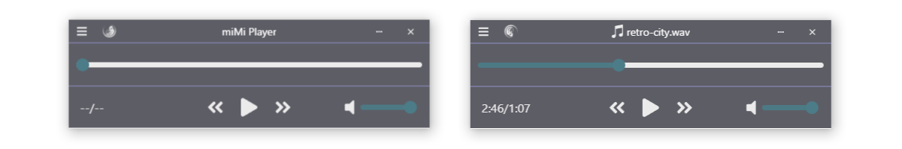
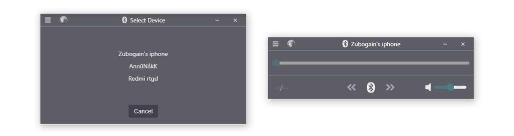

## Overview

miMi Player is a desktop player application.

> Decode and play WAV, MP3, OGG, and FLAC formats.

> Play audio via Bluetooth from your mobile device to your PC.

## Installation

### Downloads

Download the latest version from the [releases page](https://github.com/Zubogain/miMi-player/releases).

miMi Player is only available for Windows 10 or higher.

## Technologies

miMi Player is built using [Wails](https://wails.app/) and uses [JavaScript](https://wikipedia.org/wiki/JavaScript) on the frontend and [Go](https://go.dev/) on the backend.

## FOSSA Status

## Copyright (proprietary license)

Copyright © Emil Shergali - All rights reserved.

The source code of this software is provided for informational purposes only, without the right to copy, commercially exploit, distribute or any modification.

Unauthorised using of this software is strictly forbidden.

Written by: <zubogain@gmail.com>, 20.01.2023
